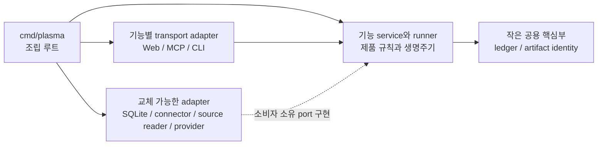

# Plasma 아키텍처 지도

이 문서는 Plasma 코드의 소유 위치와 허용 의존성을 빠르게 찾는 진입 지도입니다. 영어
[기준 지도](README.md)와 같은 의미를 유지합니다. 자세한 제품 동작은
[제품 아키텍처](../product-architecture.ko.md)에 남깁니다.

## 전체 패키지 HTML 지도

[Plasma Package Atlas](package-atlas.html)는 모든 Go 패키지, 패키지 주석 전문,
소스·테스트 파일과 실제 직접 import/역참조를 담은 오프라인 HTML/SVG 문서입니다.
Mermaid·CDN·외부 폰트가 필요 없으며, 파일을 브라우저에서 직접 열면 검색·선택·확대가
동작합니다. GitHub 파일 화면은 HTML을 실행하지 않으므로 checkout의 파일을 여세요.
이 문서의 개념적 허용 경계와 달리, Atlas의 화살표는 현재 코드의 실제 import입니다.

[v0.17 착수 전 LEGACY 지도](package-atlas-v0.17-pre-refactor-legacy.html)는
#483 시작 전 `d027ab6`의 94개 패키지를 담습니다. v0.17 릴리즈 태그가 아니라
리팩토링 착수 전 snapshot이며, 파일명은 당시 구조를 설명하는 정보로만 제공합니다.
현재 지도는 111개 패키지를 담고 있으며 양쪽에서 서로 이동할 수 있습니다.

갱신: `python3 plasma/scripts/generate-package-atlas.py` (저장소 루트 기준).
과거 지도 재생성은 `--source-root <과거-checkout>/plasma --legacy-label 'v0.17 리팩토링 착수 전' --output <출력 HTML>`로 실행합니다.

## 이 지도를 사용하는 방법

| 질문 | 확인할 곳 |
| --- | --- |
| 이 동작은 어느 기능이 소유하는가? | [기능 소유권](#기능-소유권) |
| Package A가 package B를 import해도 되는가? | [의존성 지도](#의존성-지도)와 [패키지 경계 규칙](package-boundaries.ko.md) |
| HTTP, MCP, CLI 코드가 이 제품 결정을 내려도 되는가? | [계층 지도](#계층-지도) |
| 같은 기술 영역인 package도 너무 클 수 있는가? | [경계 검토](package-boundaries.ko.md#경계-검토) |
| 현재 알려진 예외는 무엇인가? | [현재 전환 상태](#현재-전환-상태) |

## 의존성 지도

화살표는 runtime 호출 방향이 아니라 compile-time 의존 방향입니다. 기능 package는 runtime에 자신의 port를
통해 adapter를 호출할 수 있지만, 구체 adapter package를 import하지 않습니다.

## 계층 지도

| 계층 | 소유하는 것 | 소유하지 않는 것 |
| --- | --- | --- |
| 조립 루트 | 구현 생성, 설정, port 연결 | 재사용 제품 규칙과 기능 구현 |
| 기능별 transport adapter | HTTP, MCP, CLI 파싱과 protocol 응답·오류 매핑 | 제품 정책, 영속 제품 상태, 백그라운드 실행 |
| 기능 package | 제품 의미, 상태 전이, 생명주기, 소비자 관점 port | Protocol shape와 구체 infrastructure |
| Runner | 장기 작업의 시작, 진행, 재시도, 중지, 취소, 복구, 멱등성 | HTTP request 또는 MCP tool 수명 |
| 교체 가능한 adapter | SQLite, connector, source reader, provider 구현 | 제품 정책과 소비자에게 강요하는 adapter 소유 contract |
| 공용 핵심부 | 여러 기능이 실제로 공유하는 작고 안정적인 identity 또는 primitive | 잡다한 helper, 넓은 model 묶음, service locator |

Transport 전체는 하나의 기능이 아닙니다. Web, MCP, CLI 안의 제품 기능이 독립적으로 변하면 기능별 adapter
package로 나눠야 합니다. 같은 DB 엔진이나 같은 report 영역이라는 이유도 무제한으로 큰 package를 정당화하지
않습니다.

## 기능 소유권

| 기능 | 소유하는 것 | 현재 주요 위치 | 향할 경계 |
| --- | --- | --- | --- |
| Mission과 ledger | Mission identity, event append contract, projection, lifecycle, active-work rule | `internal/mission`, `internal/ledger`, `internal/ledgerstate`; 임시 `internal/app` facade | 기능 소유 model과 port; transport는 변환만 담당 |
| Conversation과 research result | Turn/result 의미, projection된 대화 상태, evidence/claim/question/option record, claim confidence, proposal과 transport-neutral research catalog contract 및 algorithm | `internal/conversation`, `internal/researchproposal`, `internal/researchcatalog`, `internal/researchrecords`; application lookup, materialization과 persistence/atomic I/O는 `internal/app`에 남음 | Record 생성/confidence, proposal 생성/decision과 catalog pagination/reference 정책을 Web과 MCP 밖에 유지 |
| Source | Artifact, snapshot, locator, candidate 승인, retrieval policy, source state | `internal/artifact`, `internal/source`, `internal/sourceingest`, `internal/sourceretrieval`, `internal/pdfdocument`, `internal/sourceevents`, `internal/sourcecandidates`, `internal/sources/*`; 임시 `internal/app` facade | URL 수집과 PDF 문서 규칙을 transport에서 분리하고 browser·local-file adapter와 구분 |
| Workflow | Run/step lifecycle, stop/cancel, continue, recovery, 실행 | `internal/workflow`, `internal/workflowruns`, `internal/workflowstate`; `internal/app`의 임시 요청 facade | `workflow.Supervisor`가 process 실행과 재조정을 소유하고 transport는 provider adapter와 protocol 변환만 제공 |
| Reporting | Requirement, plan, section, part, assembly, edit, render, prompt policy, pipeline family, report-run completion, terminal state, recovery | `internal/reportexecution`, `internal/reportpipeline`, `internal/reportworkflow`, `internal/reportrun`, `internal/reporting`, `internal/reportusage`, `internal/reportprompt`, `internal/web`; `internal/app`의 임시 facade | 실행 수명주기는 `reportexecution`, 닫힌 독립 pipeline family 계약은 `reportpipeline`, 고정 report graph 선택과 typed stage 연결은 `reportworkflow`, report-run 등록/완료/recovery는 `reportrun`, durable report 계약은 `reporting`, 생성 prompt 정책은 `reportprompt`에 두고, 독립 변경 단위별 보고서 하위 기능과 얇은 호환 표면을 유지 |
| Agent 실행 | Provider request/result, model 선택 입력, session, fork/reset, usage | `internal/agentexec`, `internal/agentpolicy`, `internal/agentmodels`, `internal/agentusage`; 임시 Web alias | `agentexec`가 provider process와 session을 소유하고 transport는 prompt와 요청 변환을 소유 |
| 외부 connector | 외부 identity, access, browse, refresh, version metadata | `internal/confluenceaccess`, `internal/connectors/*`; 임시 `internal/app` facade | Source 또는 connector 기능 port 뒤의 구현 |
| Persistence | Connection, transaction, migration, 기능별 repository 구현 | `internal/storage/sqlite` | 작은 SQLite 기반부와 기능 port별 adapter |
| 제품 표면 | Browser HTTP, MCP tool, CLI command | `internal/web`, `internal/mcp`, `internal/mcp/mission`, `internal/mcp/research`, `internal/mcp/workflow`, `internal/mcp/wire`, `internal/mcptools`, `cmd/plasma` | 안정적인 tool 이름은 transport-neutral `mcptools` contract에 두고 schema와 handler는 기능 adapter가, dispatch와 공통 transport 정책은 루트 adapter가 소유 |

“현재 주요 위치”는 오늘의 저장소를 설명하며 최종 package 이름을 확정하지 않습니다. Refactoring에서는 소비자를
추적하고 공개 동작을 특성화한 뒤 정확한 이름을 정합니다.

## 코드 배치 순서

1. 제품 의미나 상태 전이를 정의하면 해당 기능에 둡니다.
2. 오래 실행되는 작업의 진행, 취소, 재시도, 복구를 제어하면 해당 기능 runner에 둡니다.
3. HTTP, MCP, CLI protocol을 읽거나 만들면 해당 기능의 transport adapter에 둡니다.
4. SQLite, 외부 서비스, local source, agent provider를 호출하면 소비자 소유 port를 교체 가능한 adapter로
   구현합니다.
5. 구현을 생성하고 연결하기만 하면 `cmd/plasma`에 둡니다.
6. 공용으로 보이면 먼저 그 의미를 부여하는 기능을 찾습니다. 여러 기능이 같은 안정적 primitive를 실제로
   소유할 때만 작은 공용 핵심부를 만듭니다.

## 현재 전환 상태

| 경계 | 현재 문제 | 추적 |
| --- | --- | --- |
| `internal/app` | Workflow, research lookup/materialization, report legacy model, persistence/atomic I/O, reporting, connector와 일부 source/artifact/mission service facade를 유지하며, research-record와 proposal 생성/decision contract는 더 이상 소유하지 않음 | Issue #66; #483 source/artifact/mission slice와 research catalog, research-record, proposal slice |
| `internal/web` | HTTP와 상류 report orchestration, terminal finalization 밖의 provider 동작, recovery, source fetch를 혼합 | Issue #66 |
| `internal/mcp` | Research 도구는 분리했지만 mission, source, workflow, report adapter가 여전히 루트 transport package를 공유 | Issue #66 |
| `internal/reporting` | 실행 생명주기와 terminal finalization을 분리한 뒤에도 plan, writing, edit, render, durable final-edit 계약이 큰 package 하나에 남아 있음 | Issue #66 |

이 예외들은 선례가 아니라 이행 부채입니다. Refactoring은 공개 Web, MCP, CLI, event, storage 동작을 보존하며
각 단계가 독립적으로 검증 가능한 형태로 진행해야 합니다.

Workflow 이관 이후에는 runner, process-local run 등록부, background lifetime, cancel,
queued/stopping/interrupted 재조정이 `internal/workflow`에 있습니다. Web은 구성된 provider를
선택하고 HTTP 요청·응답을 변환하지만 실행 정책은 더 이상 소유하지 않습니다.
Transport가 좁은 application API로 옮겨갈 때까지 `internal/app`의 workflow 요청 facade만
임시로 남습니다.

보고서 실행 이관 이후에는 draft, design, patch와 legacy/manual post-canonical H5
compatibility humanization의 pending-to-terminal 수명주기, in-flight 소유권, 취소, 복구
 decode, terminal 실패 기록이 `internal/reportexecution`에 있습니다. 이 compatibility 경로는
active long-form 경로가 아닙니다. Active long-form pre-canonical style-edit stage는 reporting
pipeline의 일부로 별도 `internal/reportworkflow`에 남습니다. Web과 CLI는 요청을 변환하고
생성 callback을 제공합니다. Plan과 requirement-map의 durable lifecycle은
`internal/reportworkflow/plan`과 `internal/reportworkflow/requirements`가 소유하며, 기존
report contract를 사용하고 root `RunnerConfig.Lifecycle` wiring을 compatibility 입력으로
유지합니다. `internal/reportrun`은 report-run 등록, delayed usage completion bookkeeping,
결정적 completion event와 DB 전용 recovery를 소유합니다. completion 구현은 canonical ledger,
mission, agent-usage, report-usage contract만 사용하며 reporting package나 transport/storage
adapter를 import하지 않습니다. `internal/reporting`은 durable report contract, writing, edit,
render를 계속 소유하며, `internal/reportusage`는 지연 agent usage event 기록과 metadata projection을
소유합니다. 임시 실행 호환 표면은 Issue #66 안에서 단계적으로 제거합니다.

MCP tool 이름의 wire constant는 이제 `internal/mcptools`에 있습니다. Web과 CLI는 MCP transport를
import하지 않고 이 transport-neutral contract에 의존할 수 있습니다. Tool schema, dispatch,
handler, prompt, enabled-tool 정책은 계속 각 기능 adapter가 소유합니다.

MCP mission 도구의 입력 model, 전체 입력 decode, schema, 검증, application port 호출은 이제
`internal/mcp/mission`과 `internal/mcp/workflow`가 각각 mission과 workflow request model, 전체 입력 decode, schema, 검증, application port 호출을 소유합니다. 루트 `internal/mcp`는 유일한 진입점으로 stdio, tool 목록 조립,
binding, enabled-tool 필터, 멱등성, trace를 소유하며 mission adapter를 직접 import합니다. 또한
workflow start/status/stop도 동일한 feature adapter 경계를 사용하며, mission.update는 binding, session, producer, cache 검사보다 먼저 전체 입력을 decode합니다. `internal/mcp/wire`는 두 package가 공유하는 JSON envelope만 소유하고
dispatch나 제품 정책을 포함하지 않습니다. Import 경계 검사는 이 진입 방향과 각 package의 좁은
outbound dependency를 고정합니다.

Provider request/result contract, Codex·Claude process adapter, MCP process 설정, session fork와
readiness는 이제 `internal/agentexec`에 있습니다. Web은 research prompt와 HTTP orchestration을
유지하고 CLI는 실행 기능을 직접 사용합니다. 남은 이관 중에는 기존 내부 호출자의 source compatibility를
위해 얇은 Web alias만 유지합니다.

Artifact 기반, 기존 artifact 연결 및 live reference snapshot의 source 생성 request/result 계약은 이제
`internal/source`에 있습니다. Snapshot 검증, locator parsing, retrieval policy와 영속화 없는 조립도 source가
소유합니다. Application service는 artifact/snapshot/event의 원자적 commit 조율을 유지하며 app builder
wrapper는 남기지 않습니다. Raw artifact 생성, storage URI와 identity/content 검증, 정규화, timestamp 캡처,
방어적 복사는 `internal/artifact`가 소유하고 persistence와 atomic transaction은 app에 남습니다.

미션 metadata/lifecycle 변경 계약과 순수 append request 조립, 정규화, idempotency 정책은 이제
`internal/mission`이 소유합니다. App service는 조건부 append, projection rebuild, active-work 검증의 I/O
adapter로 남고, transport와 storage는 이 규칙을 소유하지 않습니다. 이 source/artifact/mission 소유권 변경과 research catalog, research-record, proposal slice가 이번 #483
기록의 완료 범위입니다. 전체 research IDE 추출은 완료하지 않았습니다. Application orchestration,
lookup, visibility, materialization, persistence/atomic I/O, report legacy model은 workflow, reporting,
connector facade와 함께 다음 slice를 위해 `internal/app`에 남아 있습니다. Evidence, claim, question,
option record 생성과 claim confidence는 `internal/researchrecords`가 소유하고 proposal 생성과 decision은
`internal/researchproposal`가 소유합니다.

Evidence package는 정확히 `internal/ledger`, `internal/producterror`, `internal/source` root contract만 import합니다.
Architecture test는 내부 child와 허용되지 않은 app, transport, SQL import를 거부하며 baseline debt는 추가하지 않습니다.

복구된 #483 기록은 [Backend Refactor #483](backend-refactor-483.ko.md)와 [영문 기록](backend-refactor-483.md)에
있습니다. 복구 사고, checkpoint 계보, 전후 측정값, 전체 application-boundary refactoring이 완료되지 않았다는
점을 함께 기록합니다.

App builder wrapper는 남기지 않습니다.

### 현재 측정 checkpoint (`6d89457`, 2026-09-08)

현재 직접 non-test, non-generated Go-file 수치는 `internal/app` 77/12,639 lines,
`internal/researchcatalog` 6/921, `internal/researchinspection` 4/271,
`internal/researchrecords` 10/1,117, `internal/researchproposal` 5/786입니다.
Architecture import-debt 기준선은 105개이며 `app-hub` 101개,
`transport-to-adapter` 4개, `capability-to-adapter` 0개입니다. 이전 145→118 결과는
현재 범위가 아니라 dated historical snapshot입니다.

CLI same-package 분할은 열 개 파일과 app-import baseline row 일곱 개를 추가했지만 기존
`source_commands.go` edge는 남아 있으며 새 package edge는 없습니다. Legacy/manual
post-canonical H5 compatibility 표면의 historical 실행과 recovery contract는
`internal/reporthumanize`에 기록되어 있습니다. Active long-form pre-canonical style
pipeline은 이 package가 아닌 별도의 `internal/reportworkflow` reporting stage이며,
Web과 CLI는 각 경로의 transport orchestration을 유지합니다.

검증은 한정적으로 기록합니다. 알려진 `go vet ./...` 진단은
`source_commands_auth.go` 36행과 90행에 있습니다. PDF는
`internal/reportilpdf`의 9개 test와 외부에서 작성된 Phase 0 test 1개로 복원되었고,
bridge 자체는 test가 아닙니다. H5 humanization duplicate rejection failure/recovery test는 auto-compaction
refactor 중 surfaced되었습니다. 테스트한 race condition에서 baseline과 변경 버전 모두
failure가 20/20 재현되어 아직 해결되지 않았습니다. 이후 targeted normal test는 통과했지만
globally deterministic 또는 all-race-green이라고 주장하지 않습니다. 최근 full-module test
pass와 selected PDF race pass는 서로 다른 결과입니다.

`6d89457`까지의 checkpoint 계보와 이전 복구 사고는 [Backend Refactor #483](backend-refactor-483.ko.md)에
보존되어 있으며, 그 문서의 dated snapshot은 현재 측정값으로 읽지 않아야 합니다.

Research catalog service는 `internal/researchcatalog`가 소유합니다. 이 package에는 `ObjectRef`,
`ObjectSummary`, `Page`, `References`, 정확한 research object-kind constant, outline/list orchestration,
source/artifact/ledger/research-record summary, report block read, locator metadata projection, reference
deduplication과 normalization, kind gate, limit, cursor, pagination, containment, backward-reference 순수
algorithm이 있습니다. 협력자는 canonical root mission, source, artifact, ledger, researchrecords contract와
product error뿐이며 proposal이나 app reverse dependency는 없습니다. Persistence, visibility, upload/read
policy, adapter, transport는 app-owned callback으로 공급됩니다. App 소유 outline, read, grep, changes
DTO는 `internal/app`에 남기되 중첩 type으로 catalog contract를 사용합니다. Application visibility와
payload materialization은 의도적으로 다음 slice까지 app 소유로 남겼습니다.

보고서 생성 prompt 정책은 이제 `internal/reportprompt`에 있습니다. Web과 CLI는 prompt envelope과
transport별 요청 흐름을 소유하지만, guidance profile 정규화, guidance text, guidance hash, Mermaid
작성 규칙, long-form composition strategy 선택은 이 transport-neutral package를 통해 공유합니다.

일반 보고서 patch의 provider session 선택, MCP tool 순서, agent prompt는 이제
`internal/reportpatch`가 소유합니다. Web과 CLI는 각 transport 입력을 이 기능 계약으로 변환하며,
HTTP route, CLI flag, MCP schema와 patch artifact 저장은 각 adapter와 기존 보고서 계층에 남습니다.

Legacy/manual post-canonical H5 compatibility 실행, same-session patch binding, 검증,
terminal 이벤트 적용, 실패/no-op 시 원본 보존, 재시작 복구 contract는
`internal/reporthumanize`에 기록되어 있으며 active long-form 경로가 아닙니다. Active
long-form pre-canonical style-edit stage는 별도의 `internal/reportworkflow` reporting
pipeline에 남아 있습니다. Web은 관련 경로의 HTTP 요청 정규화, executor/model 선택,
route lock과 orchestration을 유지하고 CLI는 Web을 import하지 않습니다.

SQLite persistence의 connection lifecycle, migration, maintenance와 기능 간 transaction은 이제
루트 `internal/storage/sqlite` facade가 소유합니다. Mission, artifact, research, report,
Confluence, model-default SQL은 그 아래의 루트 전용 기능별 repository로 나뉩니다. Facade는 기존
`Store` method 집합을 유지하며, import 검사는 transport와 이웃 repository가 루트 경계를 우회하지
못하게 합니다.

## 상세 문서

- [패키지 경계 규칙](package-boundaries.ko.md): package와 import 규칙, 분할 신호, refactoring 순서.
- [제품 아키텍처](../product-architecture.ko.md): 제품 동작과 기능별 상세 경계.
- [C1 기본 루프](../c1-default-loop.ko.md): 현재 사용자 관점 제품 흐름.
- [용어집](../glossary.ko.md): 안정된 제품 용어.
