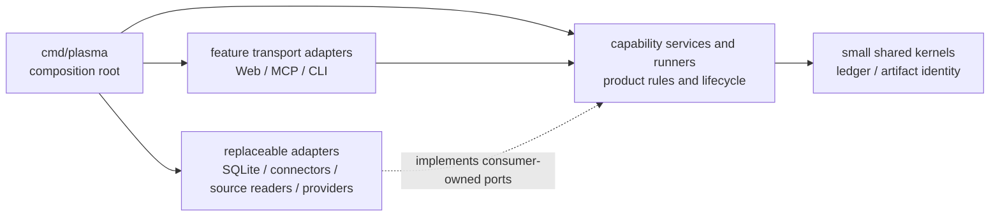

# Plasma Architecture Map

This is the entry map for deciding where Plasma code belongs and which
dependencies are allowed. Read the synchronized [Korean map](README.ko.md) when
that is easier. Detailed product behavior remains in
[Product Architecture](../product-architecture.md).

## Use This Map

| Question | Look here |
| --- | --- |
| Which capability owns this behavior? | [Capability ownership](#capability-ownership) |
| May package A import package B? | [Dependency map](#dependency-map) and [Package Boundaries](package-boundaries.md) |
| Is this HTTP, MCP, or CLI code allowed to make a product decision? | [Layer map](#layer-map) |
| Is a package too broad even if it represents one technical area? | [Boundary review](package-boundaries.md#boundary-review) |
| Which current packages are known exceptions? | [Current transition](#current-transition) |

## Dependency Map

Arrows show allowed compile-time dependency direction, not runtime call
direction. A capability may call an adapter through its own port at runtime
without importing the concrete adapter package.

## Layer Map

| Layer | Owns | Does not own |
| --- | --- | --- |
| Composition root | Construction, configuration, and port wiring | Reusable product rules or feature implementation |
| Feature transport adapter | HTTP, MCP, or CLI parsing; protocol response and error mapping | Product policy, durable product state, background execution |
| Capability | Product meaning, state transitions, lifecycle, and consumer-side ports | Protocol shape or concrete infrastructure |
| Runner | Start, advance, retry, stop, cancel, recovery, and idempotency for long work | HTTP request or MCP tool lifetime |
| Replaceable adapter | SQLite, connector, source-reader, or provider implementation | Product policy or adapter-owned contracts forced on consumers |
| Shared kernel | A small, stable identity or primitive genuinely shared by capabilities | Miscellaneous helpers, broad models, or service location |

Transport is not one capability. Web, MCP, and CLI packages must be partitioned
by the product feature they adapt when those features change independently.
Likewise, one database engine or one report domain does not justify an
unbounded package.

## Capability Ownership

| Capability | Owns | Current primary locations | Direction |
| --- | --- | --- | --- |
| Mission and ledger | Mission identity, event append contracts, projections, lifecycle, and active-work rules | `internal/mission`, `internal/ledger`, `internal/ledgerstate`; `internal/app` retains I/O orchestration | Capability-owned models and ports; transports only adapt them |
| Conversation and research results | Turn/result meaning, projected conversation state, evidence/claim/question/option records, claim confidence, proposals, and transport-neutral research catalog contracts/algorithms | `internal/conversation`, `internal/researchproposal`, `internal/researchcatalog`, `internal/researchrecords`; `internal/app` retains application lookup, materialization, and persistence/atomic I/O | Keep record creation/confidence, proposal creation/decision, and catalog pagination/reference policy outside Web and MCP |
| Sources | Artifacts, snapshots, locators, candidate acceptance, retrieval policy, and source state | `internal/artifact`, `internal/source`, `internal/sourceingest`, `internal/sourceretrieval`, `internal/pdfdocument`, `internal/sourceevents`, `internal/sourcecandidates`, `internal/sources/*`; `internal/app` retains commit/service orchestration | Keep URL retrieval and PDF document rules transport-neutral; separate them from browser and local-file adapters |
| Workflow | Run and step lifecycle, stop/cancel, continuation, recovery, and execution | `internal/workflow`, `internal/workflowruns`, `internal/workflowstate`; temporary request facade in `internal/app` | `workflow.Supervisor` owns process execution and reconciliation; transports supply provider adapters and protocol mapping |
| Reporting | Requirements, plans, sections, parts, assembly, editing, rendering, prompt policy, pipeline families, report-run completion, terminal state, and recovery | `internal/reportexecution`, `internal/reportpipeline`, `internal/reportworkflow`, `internal/reportrun`, `internal/reporting`, `internal/reportusage`, `internal/reportprompt`, `internal/web`; temporary `internal/app` facade | Keep execution lifecycle in `reportexecution`, the closed independent pipeline-family contract in `reportpipeline`, fixed report graph selection and typed stage wiring in `reportworkflow`, report-run registration/completion/recovery in `reportrun`, durable report contracts in `reporting`, and generation prompt policy in `reportprompt`; split independently changing report sub-capabilities and keep compatibility surfaces thin |
| Agent execution | Provider request/result, model selection inputs, sessions, fork/reset, and usage | `internal/agentexec`, `internal/agentpolicy`, `internal/agentmodels`, `internal/agentusage`; temporary Web aliases | `agentexec` owns provider processes and sessions; transports own prompts and request mapping |
| External connectors | External identity, access, browse, refresh, and version metadata | `internal/confluenceaccess`, `internal/connectors/*`; temporary `internal/app` facade | Connector implementations behind source or connector capability ports |
| Persistence | Connection, transactions, migrations, and feature repository implementations | `internal/storage/sqlite` | Small SQLite core plus feature adapters implementing capability ports |
| Product surfaces | Browser HTTP, MCP tools, and CLI commands | `internal/web`, `internal/mcp`, `internal/mcp/mission`, `internal/mcp/research`, `internal/mcp/workflow`, `internal/mcp/wire`, `internal/mcptools`, `cmd/plasma` | Stable tool names live in the transport-neutral `mcptools` contract; schemas and handlers stay in feature adapters, while root adapters own dispatch and shared transport policy |

“Current primary locations” describes the repository today, not the desired
final package names. A refactor chooses exact names after tracing consumers and
characterizing public behavior.

## Placement Guide

1. If code defines product meaning or a state transition, place it with the
   owning capability.
2. If it controls long-running progress, cancellation, retry, or recovery,
   place it with the capability runner.
3. If it parses or renders HTTP, MCP, or CLI protocol, place it in that
   capability's transport adapter.
4. If it talks to SQLite, an external service, a local source, or an agent
   provider, implement a consumer-owned port in a replaceable adapter.
5. If it only constructs and connects implementations, place it in
   `cmd/plasma`.
6. If it appears shared, choose the capability that gives it meaning first.
   Create a shared kernel only when multiple capabilities genuinely own the
   same stable primitive.

## Current Transition

| Boundary | Current problem | Tracking |
| --- | --- | --- |
| `internal/app` | Retains workflow, research lookup/materialization, report legacy models, persistence/atomic I/O, reporting, connector, and selected source/artifact/mission service facades; research-record and proposal creation/decision contracts are no longer app-owned | Issue #66; #483 source/artifact/mission slice plus research catalog, research-record, and proposal slices |
| `internal/web` | Mixes HTTP with upstream report orchestration, provider behavior outside terminal finalization, recovery, and source fetching | Issue #66 |
| `internal/mcp` | Research tools are separated, but mission, source, workflow, and report adapters still share the root transport package | Issue #66 |
| `internal/reporting` | Planning, writing, editing, rendering, and durable final-edit contracts still share one large package after execution lifecycle and terminal finalization extraction | Issue #66 |

These exceptions are migration debt, not precedent. Refactoring must preserve
public Web, MCP, CLI, event, and storage behavior and proceed in independently
testable waves.

The workflow migration now keeps the runner, process-local run registry,
background lifetime, cancellation, and queued/stopping/interrupted reconciliation
inside `internal/workflow`. Web still selects a configured provider and maps HTTP
requests and responses, but it no longer owns those execution policies. The
temporary `internal/app` workflow request facade remains until transport adapters
move to the focused application API.

The report execution migration now keeps draft, design, patch, and the
legacy/manual post-canonical H5 compatibility humanization pending-to-terminal
lifecycles, in-flight ownership, cancellation, recovery decoding, and terminal
failure writes in `internal/reportexecution`. This compatibility path is not the
active long-form path. The active long-form pre-canonical style-edit stage remains
separate in `internal/reportworkflow` as part of the reporting pipeline. Web and
CLI adapt requests and provide generation callbacks. The plan and requirement-map
durable lifecycles are stage-owned in `internal/reportworkflow/plan` and
`internal/reportworkflow/requirements`; they consume the existing report
contracts and keep the root `RunnerConfig.Lifecycle` wiring as a compatibility
input. `internal/reportrun` owns report-run registration, delayed-usage completion
bookkeeping, deterministic completion events, and DB-only recovery. Its completion
code depends only on canonical ledger, mission, agent-usage, and report-usage
contracts; it does not import the reporting package or transport/storage adapters.
`internal/reporting` continues to own durable report contracts, writing, editing,
and rendering; `internal/reportusage` owns delayed agent-usage event recording and
metadata projection. The temporary execution compatibility surface is removed
incrementally within Issue #66.

Source creation request/result contracts for artifact-backed, existing-artifact,
and live-reference snapshots now belong to `internal/source`, alongside snapshot
validation, locator parsing, retrieval policy, and non-persisting assembly. The
application service retains atomic artifact/snapshot/event commit orchestration;
no app builder wrappers remain. `internal/artifact` owns raw-artifact construction,
storage URI and identity/content validation, normalization, timestamp capture, and
defensive copying; persistence and atomic transactions remain in app.

Mission metadata and lifecycle change contracts and their pure append-request,
normalization, and idempotency policy now belong to `internal/mission`. The app
service remains the I/O adapter for conditional append, projection rebuild, and
active-work validation. Transport and storage packages do not own these rules.
These source/artifact/mission ownership changes and the research catalog,
research-record, and proposal slices are the completed #483 work recorded here.
Full research IDE extraction is not complete: application orchestration, lookup,
visibility, materialization, persistence/atomic I/O, report legacy models, workflow,
and connector facades remain in `internal/app`. Evidence, claim, question, and
option record creation plus claim confidence live in `internal/researchrecords`;
proposal creation and decision live in `internal/researchproposal`.

The evidence package imports only the exact root contracts `internal/ledger`,
`internal/producterror`, and `internal/source`. The architecture tests reject
internal children and unrelated app, transport, or SQL imports, without adding
baseline debt.

The recovered #483 record is [Backend Refactor #483](backend-refactor-483.md),
with a [Korean version](backend-refactor-483.ko.md). It records the recovery
incident, checkpoint lineage, measured before/after counts, and the explicit
non-completion of the full application-boundary refactor.

No app builder wrappers remain.

### Current measured checkpoint (`6d89457`, 2026-09-08)

The direct non-test, non-generated Go-file counts are currently `internal/app`
77/12,639 lines, `internal/researchcatalog` 6/921, `internal/researchinspection`
4/271, `internal/researchrecords` 10/1,117, and `internal/researchproposal` 5/786.
The architecture import-debt baseline is 105 entries: 101 `app-hub`, 4
`transport-to-adapter`, and zero `capability-to-adapter`. The older 145-to-118 result is
a dated historical snapshot, not the current scope.

The CLI same-package split added ten files and seven additional app-import baseline
rows while the original `source_commands.go` edge remains; it added no package edge.
The legacy/manual post-canonical H5 compatibility surface is documented by
`internal/reporthumanize`, which retains the historical execution and recovery
contract. The active long-form pre-canonical style pipeline is a separate
`internal/reportworkflow` reporting stage and is not this package; Web and CLI
retain their transport orchestration around those paths.

Verification remains qualified: the known `go vet ./...` diagnostics are in
`source_commands_auth.go` lines 36 and 90. The PDF accounting is nine tests in
`internal/reportilpdf` plus one externally authored Phase 0 test; the bridge is not
itself a test. The H5 humanization duplicate-rejection failure/recovery test surfaced during the
auto-compaction refactor. The baseline and changed versions both reproduced that
failure 20/20 under the tested race condition and it remains unresolved; later
targeted normal tests passed, but this is not a globally deterministic or all-race-
green claim. The recent full-module test pass and selected PDF race pass are
distinct.

The checkpoint sequence through `6d89457` and the prior recovery incident remain
preserved in [Backend Refactor #483](backend-refactor-483.md), whose dated snapshots
must not be read as current measurements.

The research catalog service is owned by `internal/researchcatalog`. It
contains `ObjectRef`, `ObjectSummary`, `Page`, `References`, the exact research
object-kind constants, outline/list orchestration, source/artifact/ledger and
research-record summaries, report block reads, locator metadata projection,
reference deduplication, and the normalization, kind-gating, limit, cursor,
pagination, containment, and backward-reference algorithms. Its collaborators
are the canonical root mission, source, artifact, ledger, and researchrecords
contracts plus product errors. It has no proposal or application reverse
dependency; persistence, visibility, upload/read policy, adapters, and
transports remain supplied through app-owned callbacks. App-owned outline, read,
grep, and changes DTOs remain in `internal/app` and use catalog nested types.
Application visibility and payload materialization remain intentionally app-owned
for a later slice.

Report-generation prompt policy now lives in `internal/reportprompt`. Web and
CLI own the prompt envelopes and transport-specific request flow, but guidance
profile normalization, guidance text, guidance hashes, Mermaid writing rule, and
long-form composition strategy selection are shared through that transport-neutral
package.

Ordinary report patch provider-session selection, MCP tool ordering, and the
agent prompt now live in `internal/reportpatch`. Web and CLI adapt their
transport inputs to that capability contract, while HTTP routes, CLI flags, MCP
schemas, and patch artifact persistence remain with their existing adapters and
report layers.

Legacy/manual post-canonical H5 compatibility execution, same-session patch
binding, validation, terminal event application, safe failure/no-op preservation,
and restart recovery are documented in `internal/reporthumanize`; this package is
not the active long-form path. The active long-form pre-canonical style-edit stage
remains separate in the `internal/reportworkflow` reporting pipeline. Web keeps
HTTP request normalization, executor/model selection, route locks, and
orchestration for the relevant paths; CLI does not import Web.

MCP tool-name wire constants now live in `internal/mcptools`. Web and CLI may
depend on that transport-neutral contract without importing the MCP transport;
tool schemas, dispatch, handlers, prompts, and enabled-tool policy remain owned
by their feature adapters.

`internal/mcp/mission` now owns mission request models, full input decoding,
schemas, validation, and application-port calls. Root `internal/mcp` remains the
sole entry point and owns stdio, tool-list composition, binding, enabled-tool
filtering, idempotency, and tracing; it imports the mission adapter directly and
performs the same full mission.update decode before binding, session, producer,
and cache checks. `internal/mcp/wire` owns only the JSON envelopes shared by those two
packages; it contains no dispatch or product policy. Import checks ratchet both
this inbound ownership and each package's narrow outbound dependencies.

Provider request/result contracts, Codex and Claude process adapters, MCP
process configuration, and session fork/readiness now live in
`internal/agentexec`. Web retains research prompts and HTTP orchestration, while
CLI consumes the execution capability directly. Temporary Web aliases keep
existing internal callers source-compatible during the remaining migration.

SQLite persistence now keeps connection lifecycle, migrations, maintenance, and
cross-capability transactions in the root `internal/storage/sqlite` facade.
Mission, artifact, research, report, Confluence, and model-default SQL live in
root-only feature repositories beneath it. The facade preserves the existing
`Store` method set, while import checks prevent transports and sibling
repositories from bypassing the root boundary.

## Detail Documents

- [Package Boundaries](package-boundaries.md): normative package and import
  rules, split signals, and refactor order.
- [Product Architecture](../product-architecture.md): product behavior and
  feature-specific boundaries.
- [C1 Default Loop](../c1-default-loop.md): current user-visible product loop.
- [Glossary](../glossary.md): stable product terms.
