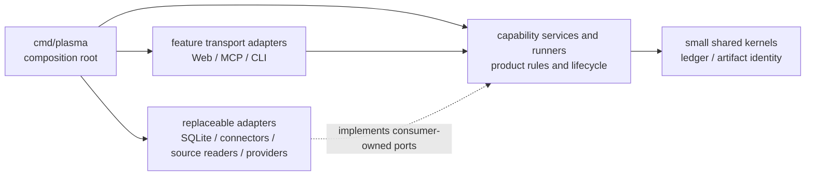

# Plasma Architecture Map

This is the entry map for deciding where Plasma code belongs and which
dependencies are allowed. Read the synchronized [Korean map](README.ko.md) when
that is easier. Detailed product behavior remains in
[Product Architecture](../product-architecture.md).

## Use This Map

| Question | Look here |
| --- | --- |
| Which capability owns this behavior? | [Capability ownership](#capability-ownership) |
| May package A import package B? | [Dependency map](#dependency-map) and [Package Boundaries](package-boundaries.md) |
| Is this HTTP, MCP, or CLI code allowed to make a product decision? | [Layer map](#layer-map) |
| Is a package too broad even if it represents one technical area? | [Boundary review](package-boundaries.md#boundary-review) |
| Which current packages are known exceptions? | [Current transition](#current-transition) |

## Dependency Map

Arrows show allowed compile-time dependency direction, not runtime call
direction. A capability may call an adapter through its own port at runtime
without importing the concrete adapter package.

## Layer Map

| Layer | Owns | Does not own |
| --- | --- | --- |
| Composition root | Construction, configuration, and port wiring | Reusable product rules or feature implementation |
| Feature transport adapter | HTTP, MCP, or CLI parsing; protocol response and error mapping | Product policy, durable product state, background execution |
| Capability | Product meaning, state transitions, lifecycle, and consumer-side ports | Protocol shape or concrete infrastructure |
| Runner | Start, advance, retry, stop, cancel, recovery, and idempotency for long work | HTTP request or MCP tool lifetime |
| Replaceable adapter | SQLite, connector, source-reader, or provider implementation | Product policy or adapter-owned contracts forced on consumers |
| Shared kernel | A small, stable identity or primitive genuinely shared by capabilities | Miscellaneous helpers, broad models, or service location |

Transport is not one capability. Web, MCP, and CLI packages must be partitioned
by the product feature they adapt when those features change independently.
Likewise, one database engine or one report domain does not justify an
unbounded package.

## Capability Ownership

| Capability | Owns | Current primary locations | Direction |
| --- | --- | --- | --- |
| Mission and ledger | Mission identity, event append contracts, projections, lifecycle, and active-work rules | `internal/mission`, `internal/ledger`, `internal/ledgerstate`; temporary `internal/app` facade | Capability-owned models and ports; transports only adapt them |
| Conversation and research results | Turn/result meaning, projected conversation state, saved research records | `internal/app`, `internal/conversation`, `internal/researchproposal` | Keep result policy outside Web and MCP |
| Sources | Artifacts, snapshots, locators, candidate acceptance, retrieval policy, and source state | `internal/artifact`, `internal/source`, `internal/sourceingest`, `internal/sourceretrieval`, `internal/pdfdocument`, `internal/sourceevents`, `internal/sourcecandidates`, `internal/sources/*`; temporary `internal/app` facade | Keep URL retrieval and PDF document rules transport-neutral; separate them from browser and local-file adapters |
| Workflow | Run and step lifecycle, stop/cancel, continuation, recovery, and execution | `internal/workflow`, `internal/workflowruns`, `internal/workflowstate`; temporary request facade in `internal/app` | `workflow.Supervisor` owns process execution and reconciliation; transports supply provider adapters and protocol mapping |
| Reporting | Requirements, plans, sections, parts, assembly, editing, rendering, prompt policy, terminal state, and recovery | `internal/reportexecution`, `internal/reportworkflow`, `internal/reporting`, `internal/reportprompt`, `internal/web`; temporary `internal/app` facade | Keep execution lifecycle in `reportexecution`, fixed report graph selection and typed stage wiring in `reportworkflow`, durable report contracts in `reporting`, and generation prompt policy in `reportprompt`; split independently changing report sub-capabilities and keep compatibility surfaces thin |
| Agent execution | Provider request/result, model selection inputs, sessions, fork/reset, and usage | `internal/agentexec`, `internal/agentpolicy`, `internal/agentmodels`, `internal/agentusage`; temporary Web aliases | `agentexec` owns provider processes and sessions; transports own prompts and request mapping |
| External connectors | External identity, access, browse, refresh, and version metadata | `internal/confluenceaccess`, `internal/connectors/*`; temporary `internal/app` facade | Connector implementations behind source or connector capability ports |
| Persistence | Connection, transactions, migrations, and feature repository implementations | `internal/storage/sqlite` | Small SQLite core plus feature adapters implementing capability ports |
| Product surfaces | Browser HTTP, MCP tools, and CLI commands | `internal/web`, `internal/mcp`, `internal/mcp/research`, `internal/mcp/wire`, `internal/mcptools`, `cmd/plasma` | Stable tool names live in the transport-neutral `mcptools` contract; schemas and handlers stay in feature adapters, while root adapters own dispatch and shared transport policy |

“Current primary locations” describes the repository today, not the desired
final package names. A refactor chooses exact names after tracing consumers and
characterizing public behavior.

## Placement Guide

1. If code defines product meaning or a state transition, place it with the
   owning capability.
2. If it controls long-running progress, cancellation, retry, or recovery,
   place it with the capability runner.
3. If it parses or renders HTTP, MCP, or CLI protocol, place it in that
   capability's transport adapter.
4. If it talks to SQLite, an external service, a local source, or an agent
   provider, implement a consumer-owned port in a replaceable adapter.
5. If it only constructs and connects implementations, place it in
   `cmd/plasma`.
6. If it appears shared, choose the capability that gives it meaning first.
   Create a shared kernel only when multiple capabilities genuinely own the
   same stable primitive.

## Current Transition

| Boundary | Current problem | Tracking |
| --- | --- | --- |
| `internal/app` | Temporarily re-exports capability-owned models while service methods are migrated | Issue #66 |
| `internal/web` | Mixes HTTP with upstream report orchestration, provider behavior outside terminal finalization, recovery, and source fetching | Issue #66 |
| `internal/mcp` | Research tools are separated, but mission, source, workflow, and report adapters still share the root transport package | Issue #66 |
| `internal/reporting` | Planning, writing, editing, rendering, and durable final-edit contracts still share one large package after execution lifecycle and terminal finalization extraction | Issue #66 |

These exceptions are migration debt, not precedent. Refactoring must preserve
public Web, MCP, CLI, event, and storage behavior and proceed in independently
testable waves.

The workflow migration now keeps the runner, process-local run registry,
background lifetime, cancellation, and queued/stopping/interrupted reconciliation
inside `internal/workflow`. Web still selects a configured provider and maps HTTP
requests and responses, but it no longer owns those execution policies. The
temporary `internal/app` workflow request facade remains until transport adapters
move to the focused application API.

The report execution migration now keeps draft, design, humanization, and patch
pending-to-terminal lifecycles, in-flight ownership, cancellation, recovery
decoding, and terminal failure writes in `internal/reportexecution`. Web and CLI
adapt requests and provide generation callbacks. `internal/reporting` continues
to own planning, writing, editing, and rendering while its temporary execution
compatibility surface is removed incrementally within Issue #66.

Report-generation prompt policy now lives in `internal/reportprompt`. Web and
CLI own the prompt envelopes and transport-specific request flow, but guidance
profile normalization, guidance text, guidance hashes, Mermaid writing rule, and
long-form composition strategy selection are shared through that transport-neutral
package.

Ordinary report patch provider-session selection, MCP tool ordering, and the
agent prompt now live in `internal/reportpatch`. Web and CLI adapt their
transport inputs to that capability contract, while HTTP routes, CLI flags, MCP
schemas, and patch artifact persistence remain with their existing adapters and
report layers.

H5 report humanization execution, same-session patch binding, validation,
terminal event application, safe failure/no-op preservation, and restart
recovery now live in `internal/reporthumanize`. Web keeps HTTP request
normalization, executor/model selection, route locks, and orchestration; CLI
calls the same transport-neutral capability directly without importing Web.

MCP tool-name wire constants now live in `internal/mcptools`. Web and CLI may
depend on that transport-neutral contract without importing the MCP transport;
tool schemas, dispatch, handlers, prompts, and enabled-tool policy remain owned
by their feature adapters.

`internal/mcp/research` now owns request models, schemas, validation, and
application-port calls for research reads and explicitly enabled legacy proposal
tools. Root `internal/mcp` remains the sole entry point and owns stdio, tool-list
composition, binding, enabled-tool filtering, the legacy gate, idempotency, and
tracing. `internal/mcp/wire` owns only the JSON envelopes shared by those two
packages; it contains no dispatch or product policy. Import checks ratchet both
this inbound ownership and each package's narrow outbound dependencies.

Provider request/result contracts, Codex and Claude process adapters, MCP
process configuration, and session fork/readiness now live in
`internal/agentexec`. Web retains research prompts and HTTP orchestration, while
CLI consumes the execution capability directly. Temporary Web aliases keep
existing internal callers source-compatible during the remaining migration.

SQLite persistence now keeps connection lifecycle, migrations, maintenance, and
cross-capability transactions in the root `internal/storage/sqlite` facade.
Mission, artifact, research, report, Confluence, and model-default SQL live in
root-only feature repositories beneath it. The facade preserves the existing
`Store` method set, while import checks prevent transports and sibling
repositories from bypassing the root boundary.

## Detail Documents

- [Package Boundaries](package-boundaries.md): normative package and import
  rules, split signals, and refactor order.
- [Product Architecture](../product-architecture.md): product behavior and
  feature-specific boundaries.
- [C1 Default Loop](../c1-default-loop.md): current user-visible product loop.
- [Glossary](../glossary.md): stable product terms.
